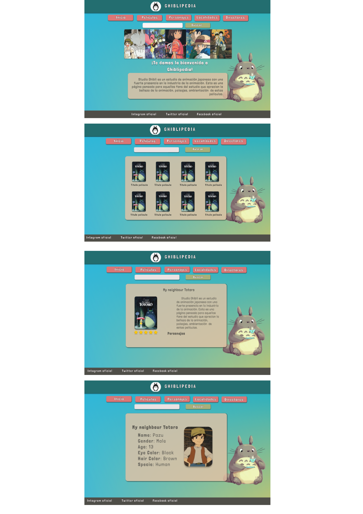

# Data Lovers

## Índice

* [1. Preámbulo](#1-preámbulo)
* [2. Historias de Usuario](#2-Historias-de-Usuario)
* [3. Diseños de prototipos de baja y alta fidelidad](#3-diseños-de-protoptipos-de-alta-fidelidad)
  * [a. Diseño de baja fidelidad](#4-diseño-debaja-fidelidad)
  * [b. Diseño de alta fidelidad](#5-diseño-de-alta-fidelidad)
* [4. Presentación del proyecto](#6-presentación-del-proyecto)
* [7. Tecnologías utilizadas](#7-tecnologías-utilizadas)
* [8. Colaboraciones](#8-colaboraciones)

***

## 1. Preámbulo

## 2. Historias de Usuario

## 3. Diseños de prototipos de baja y alta fidelidad

  ## a. Diseño de baja fidelidad

  ## b. Diseño de alta fidelidad

## 4. Presentación del proyecto

## 5. Tecnologías utilizadas

## 7. Colaboraciones

## 8. Colaboraciones

## 9. Checklist

* [ ] Usa VanillaJS.
* [sí] Pasa linter (`npm run pretest`)
* [sí] Pasa tests (`npm test`)
* [sí] Pruebas unitarias cubren un mínimo del 70% de statements, functions y
  lines y branches.
* [sí] Incluye _Definición del producto_ clara e informativa en `README.md`.
* [sí] Incluye historias de usuario en `README.md`.
* [ ] Incluye _sketch_ de la solución (prototipo de baja fidelidad) en
  `README.md`.
* [ ] Incluye _Diseño de la Interfaz de Usuario_ (prototipo de alta fidelidad)
  en `README.md`.
* [ ] Incluye link a figma en `README.md`.
* [ ] Incluye el listado de problemas que detectaste a través de tests de
  usabilidad en el `README.md`.
* [ ] UI: Muestra lista y/o tabla con datos y/o indicadores.
* [ ] UI: Permite ordenar data por uno o más campos (asc y desc).
* [ ] UI: Permite filtrar data en base a una condición.
* [ ] UI: Es _responsive_.
